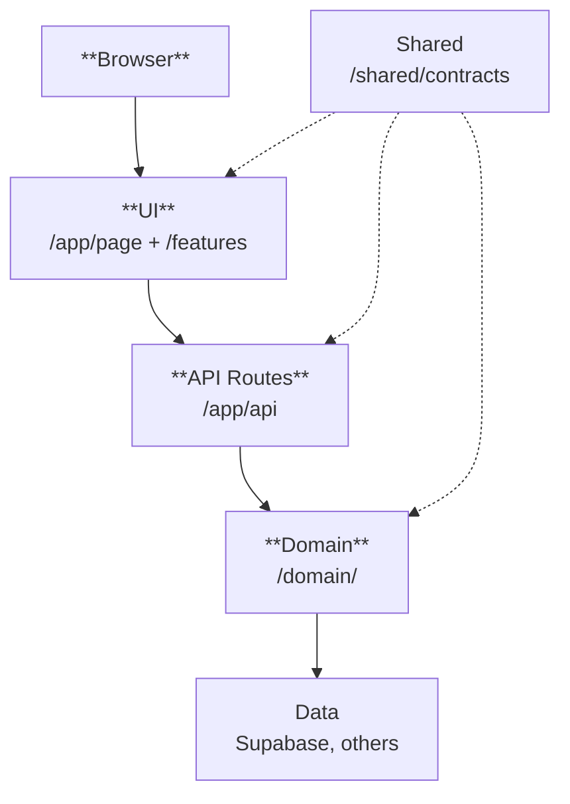

# Project Overview
Created using create-next-app...

## Tech Stack

- Next.js, React, Chakra UI, Zustand
- Supabase
- Vitest
- TypeScript
- Vercel

## File Structure
- **src/**
  - **app/** - Next.js pages and API routes
    - `api/[domainName]/route.ts` - API endpoints
    - `[page-route]/page.tsx` - Page components
  
  - **features/** - Frontend components and state
    - `[featureName]/` - Feature modules
      - `model/store.ts` - Zustand state
      - `ui/Component.tsx` - UI components

  - **domain/** - Server-side business logic
    - `[domainName]/` - Domain modules
      - `repository.ts` - Database access
      - `service.ts` - Business logic
    - `shared/services.ts` - Service registry
  
  - **shared/** - Cross-cutting concerns
    - `theme/` - Chakra UI theme
    - `contracts/[domainName]/` - Shared types
  
  - **tests/** - Test

## Architecture

