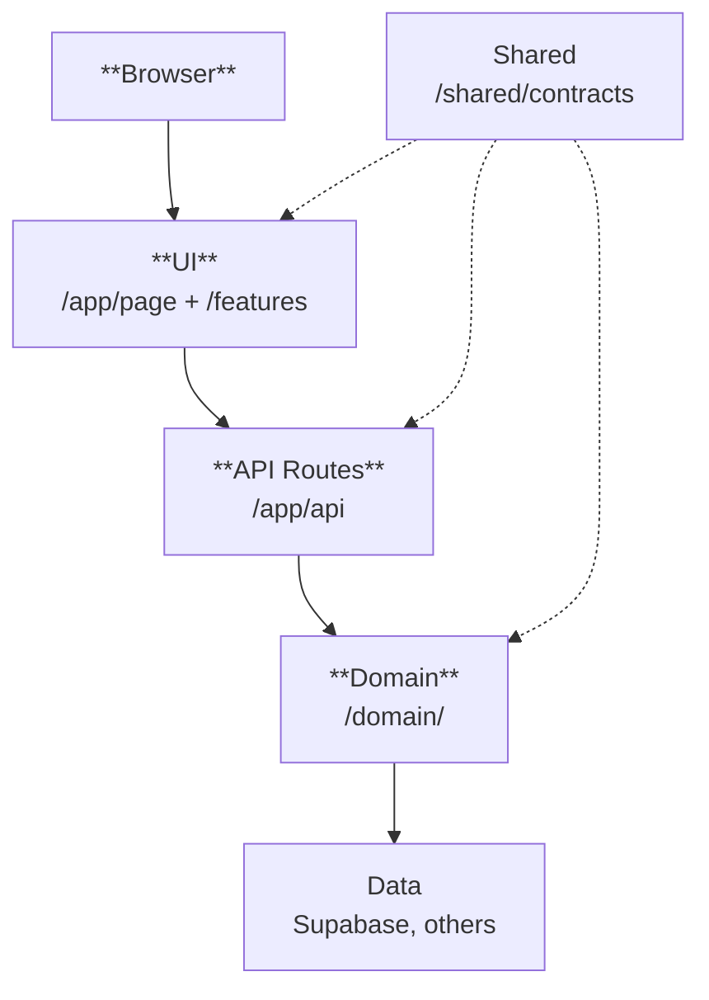

# Project Overview

## Tech Stack

- Next.js, React, Chakra UI, Framer Motion, Zustand
- Supabase
- Vitest, React Testing Library
- TypeScript
- Vercel

## File Structure
## File Structure

- **public/**: Static assets (images, fonts, icons, etc.)
  - `favicon.ico`: Site favicon
## File Structure
- **src/**
  - **app/** - Next.js pages and API routes
    - `api/[domainName]/route.ts` - API endpoints
    - `[page-route]/page.tsx` - Page components
  
  - **domain/** - Server-side business logic
    - `[domainName]/` - Domain modules
      - `repository.ts` - Database access
      - `service.ts` - Business logic
    - `shared/services.ts` - Service registry
  
  - **features/** - Frontend components and state
    - `[featureName]/` - Feature modules
      - `model/store.ts` - Zustand state
      - `ui/Component.tsx` - UI components
  
  - **shared/** - Cross-cutting concerns
    - `theme/` - Chakra UI theme
    - `contracts/[domainName]/` - Shared types
  
  - **tests/** - Test

## Development Workflow

### 1. Contract
- Create entity types in `inter-env/[domainName]/types.ts`
- Define service contracts in `contract.ts`
- Add API response types

### 2. Domain
- Create service skeleton implementing contract
- Write failing tests
- Set up Supabase table
- Implement repository and service
- Register in service registry

### 3. API Routes
- Implement HTTP handlers in `app/api/[domainName]/route.ts`
- Connect to domain services
- Test endpoints

### 4. Frontend
- Create page in `app/[page-route]/page.tsx`
- Set up feature folder with model/ui structure
- Implement and test Zustand store
- Build UI components
- Connect components


## Architecture




## Boilerplate
This is a [Next.js](https://nextjs.org) project bootstrapped with [`create-next-app`](https://nextjs.org/docs/app/api-reference/cli/create-next-app).

## Getting Started

First, run the development server:

```bash
npm run dev
# or
yarn dev
# or
pnpm dev
# or
bun dev
```

Open [http://localhost:3000](http://localhost:3000) with your browser to see the result.

You can start editing the page by modifying `app/page.tsx`. The page auto-updates as you edit the file.

This project uses [`next/font`](https://nextjs.org/docs/app/building-your-application/optimizing/fonts) to automatically optimize and load [Geist](https://vercel.com/font), a new font family for Vercel.

## Learn More

To learn more about Next.js, take a look at the following resources:

- [Next.js Documentation](https://nextjs.org/docs) - learn about Next.js features and API.
- [Learn Next.js](https://nextjs.org/learn) - an interactive Next.js tutorial.

You can check out [the Next.js GitHub repository](https://github.com/vercel/next.js) - your feedback and contributions are welcome!

## Deploy on Vercel

The easiest way to deploy your Next.js app is to use the [Vercel Platform](https://vercel.com/new?utm_medium=default-template&filter=next.js&utm_source=create-next-app&utm_campaign=create-next-app-readme) from the creators of Next.js.

Check out our [Next.js deployment documentation](https://nextjs.org/docs/app/building-your-application/deploying) for more details.
